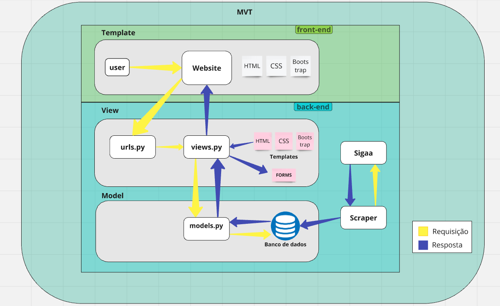

# **Introdução**
O forUnB tem como objetivo melhorar a comunicação com o estudante e monitor a partir de um fórum. Os alunos poderão participar de comunidades, criar e responder perguntas. A arquitetura escolhida foi a MVT (Model, View, Template) e vai ser utilizada dentro do framework Django.

## **Camadas**

- **Model**: aqui será a parte responsável pela nossa lógica do projeto e pelo gerenciamento dos dados da aplicação, onde funciona como um intermediário para manipular dados entre o banco de dados e a View. Na sua interação com o banco de dados ela permite a criação, leitura, atualização e exclusão (CRUD) de informações, mantendo a integridade e consistência dos dados.

- **View**: será responsável por lidar com a lógica de apresentação e a resposta aos usuários, tendo o papel de formatar os dados que são vindos do banco através da Model para visualização e selecionar os templates apropriados para renderizar a resposta. Ela atuará como a intermediária da arquitetura controlando o fluxo entre a lógica do projeto e a interface do usuário.

- **Template**: encarregada pela apresentação final dos dados para o usuário, armazenando os arquivos html, css, bootstrap estendidos a ela e define a estrutura e o layout da interface de usuário. Logo, os templates serão usados para renderizar o conteúdo visual de forma consistente e estilizada.
    
## **Tecnologias**: 
    
- A nossa aplicação utiliza HTML, CSS e Bootstrap para o front-end, Python com o framework Django no back-end. Usamos dois bancos de dados, o SQLite3 para o armazenamento de dados locais, que já vem embutido em nosso framework, além do PostgreSQL focada na parte da hospedagem.

    | **Tecnologia**    | **Versão**  |
    |---------------|---------|
    | Bootstrap     |  5.0.0  |
    | Django        |  4.2.13 |
    | Python        |  3.9.6  |

## **Diagrama da Arquitetura**

### **Como funciona?**
O Django é baseado em requisições e respostas. Sempre que há uma atualização ou mudança dentro do Template, esta solicitação é enviada para o servidor através da View, após essa requisição, a lógica da aplicação começa a funcionar pois fará a verificação dentro da Model para conseguir acessar o banco de dados. Se a requisição for válida e estiver tudo certo, é retornado um status em formato desejado através da View e que por fim é renderizado pelo Template e que responde com o arquivo HTML solicitado.
