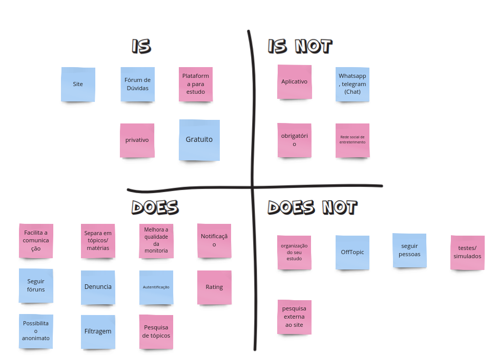
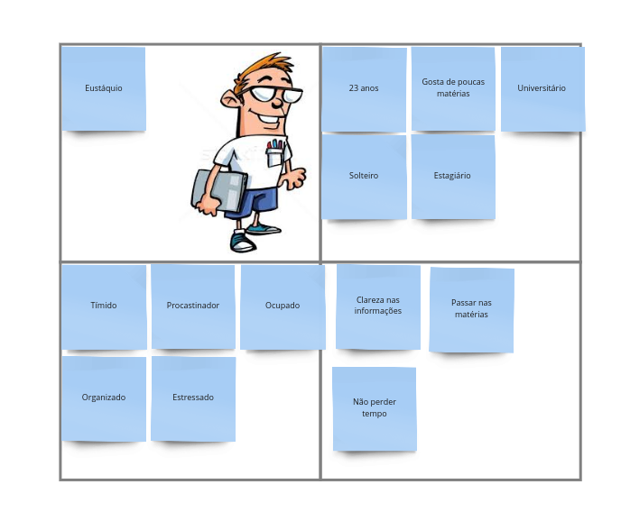
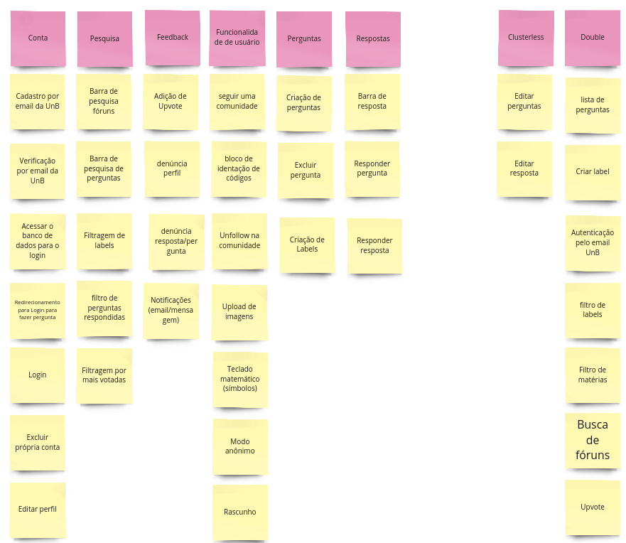
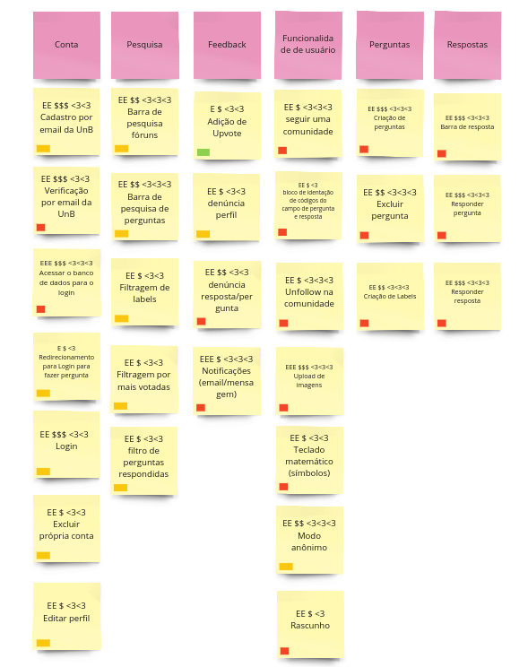

# Lean inception

## O que é?

A Lean Inception é uma abordagem colaborativa e enxuta que visa definir o escopo, os objetivos e os requisitos de um projeto de forma **eficiente** e **eficaz**. Ela se destina a criar um entendimento compartilhado entre a equipe de desenvolvimento, partes interessadas e outros envolvidos antes de iniciar um projeto. Seja ele de desenvolvimento de software, produto ou qualquer iniciativa. Concebida por [Paulo Caroli](https://caroli.org/), essa abordagem visa alcançar o Minimum Viable Product (MVP), ou Produto Mínimo Viável.

## Minimum Viable Product (MVP)

O MVP (Produto Mínimo Viável) é uma versão **simplificada** de um produto ou serviço que contém apenas as **funcionalidades essenciais** necessárias para validar sua viabilidade no mercado e obter **feedback** dos usuários. O objetivo do MVP é testar hipóteses, minimizar custos e tempo de desenvolvimento, e iterar com base nas respostas dos clientes antes de investir em uma versão completa do produto.

O funcionamento do Lean Inception se baseia em atividades estruturadas, cada uma com um papel específico no processo de definição e refinamento do MVP. Sendo estas:

1. [Visão do produto](#visao-produto)
- [É/NÃO É/FAZ/NÃO FAZ](#e-nao-e-faz-nao-faz)
- [Objetivo do Produto](#objetivo-produto)
- [Personas](#personas)
- [Jornadas do Usuário](#jornadas-usuario)
- [Brainstorming de Funcionalidades](#brainstorm-funcionalidades)
- [Revisão Técnica, de Negócio e de UX](#revisao-tecnica-negocio-ux)
- [Sequenciador](#sequenciador)

## Visão de produto 

A visão de produto em um Lean Inception é uma declaração clara e concisa que descreve a visão geral do que o produto ou projeto almeja alcançar. A visão de produto responde às **perguntas fundamentais**, como por que o projeto está sendo iniciado, quais problemas ele pretende resolver e qual é o valor que ele entregará aos usuários ou clientes. Essa declaração serve como um ponto de **partida crucial** durante o processo de Lean Inception, ajudando a garantir que todos estejam alinhados.

## É - Não É - Faz - Não Faz

É, Não é, Faz e Não Faz - desempenham um papel fundamental na definição do escopo do produto. "É" define o que é essencial, "Não é" estabelece limites claros, "Faz" descreve como as metas serão alcançadas, e "Não Faz" ajuda a evitar distrações. Essas palavras **simplificam a comunicação e alinham as equipes**, contribuindo para a criação de produtos mais eficazes e alinhados com as necessidades dos usuários.

## Objetivo de Produto

Esta etapa possui um papel muito importante para entender qual é o objetivo do nosso produto, utilizando uma linguagem **clara e objetiva** e organizando esta informação em grupos, de forma que possamos utilizá-la como base nas próximas etapas.

## Personas

Nessa atividade, a ideia é conhecer muito bem as pessoas que vão usar o produto e **entender o que elas querem**. Para isso, criamos personas, que são como personagens fictícios que representam essas pessoas. Isso ajuda a construir o produto de forma que ele seja útil e atenda às necessidades das pessoas que vão usá-lo.

### Personas 1

### Personas 2

## Jornadas do usuário

A Jornada do Usuário envolve o **mapeamento das etapas** que uma persona segue ao interagir com um produto, desde o primeiro contato até a realização de suas tarefas. De froma a ajudar a equipe identificar os pontos de contato do usuário com o produto, suas emoções, necessidades e possíveis problemas.

À medida que construímos a jornada, a equipe levanta questões sobre as necessidades do usuário e as funcionalidades do produto, permitindo melhorias ao longo do processo.

### Jornada 1

### Jornada 2

## Brainstorm de funcionalidades

O brainstorm de funcionalidades é um processo colaborativo no desenvolvimento de produtos ou projetos que envolve a geração de ideias para novas **características ou melhorias em um produto**. Durante uma sessão de brainstorm, a equipe reúne-se para gerar o maior número possível de ideias relacionadas às funcionalidades do produto. Essas ideias podem ser **diversas e variar em complexidade**.

## Revisão Técnica, de Negócio e de UX

No desenvolvimento do produto e nessa etapa do lean inception de revisão técnica são utilizados métodos de estimativas para **categorizar esforço, valor de négocio e valor de experiência de usuário**. Essas três revisões, técnicas, de negócios e de UX, são vitais para garantir que o produto seja bem-sucedido, seja tecnicamente sólido, financeiramente viável e proporcione uma excelente experiência aos usuários.

### Gráfico de semáforo

Esse gráfico recebe o nome “gráfico do semáforo”, pois as suas
cores são as mesmas de um semáforo: verde, pode ir tranquilo;
amarelo, preste atenção, talvez tenha de parar antes de prosseguir;
vermelho, pare e espere antes de prosseguir.

Basicamente esse gráfico é uma forma de se estimar que uma funcionalidade pode ser tecnicamente viável ou não em próximas etapas do Lean Inception.

### Cards da Revisão Técnica, de Negócio e de UX

Com a ajuda do gráfico de semáforos a equipe pode categorizar as funcionalidades em **como fazer**, **o que fazer** e estimar **esforço EE**, **valor de negócio $$** e **experiência de usuário <3 <3**

## Sequenciador

O Sequenciador de Funcionalidades é uma ferramenta essencial para organizar e priorizar as funcionalidades de um projeto. Ele ajuda as equipes a definir a **ordem de desenvolvimento e validação das funcionalidades**, permitindo que o produto seja construído de maneira incremental, com foco nas funcionalidades mais importantes e na entrega de valor aos usuários. Essa abordagem flexível e adaptativa é fundamental em metodologias ágeis, como o *Scrum*, para garantir o sucesso do projeto.

