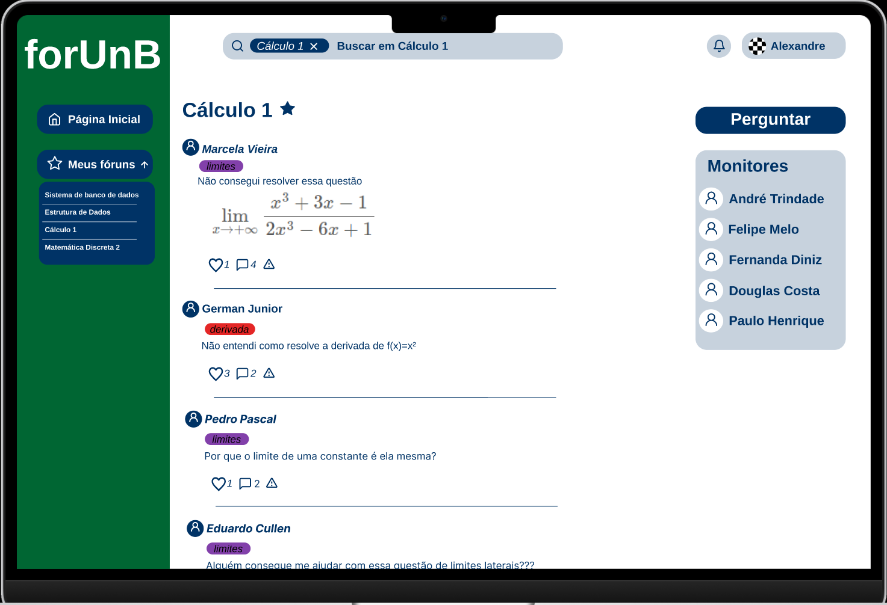
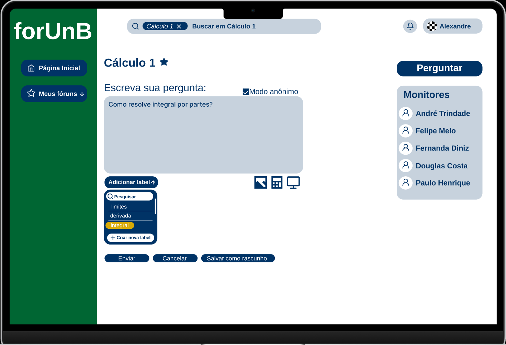
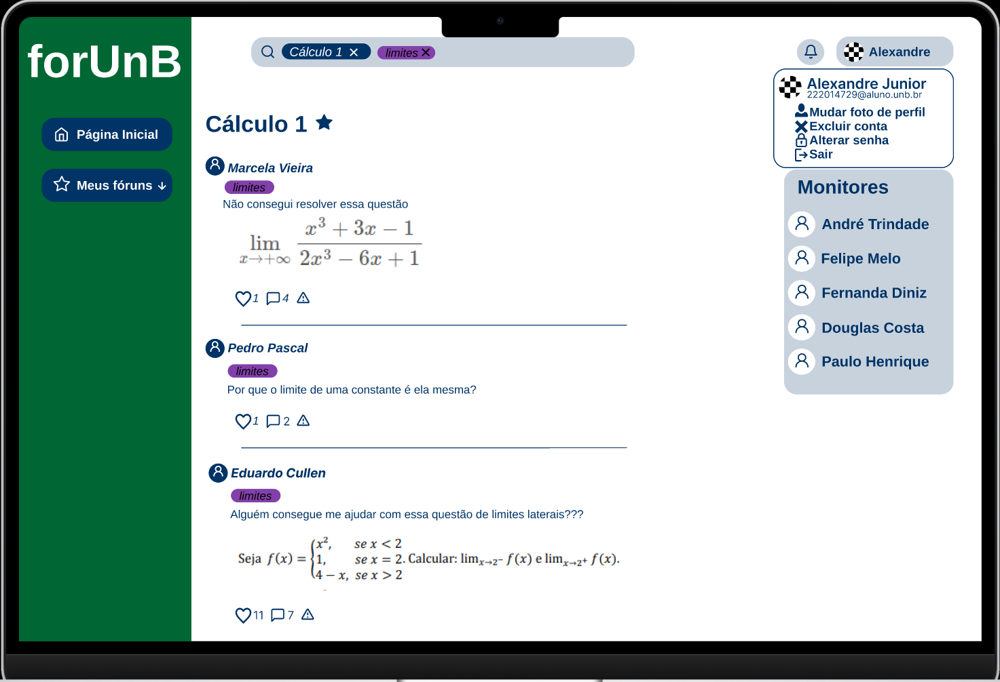

# Protótipos
Os protótipos foram feitos a partir da platafroma Figma, a qual nos permite, como grupo, ter melhor visão do produto final que queremos chegar. Nesses modelos conseguimos visualmente entender todos as funcionalidades do projeto, quais funções teriam mais ou menos prioridade e ter certeza que a visão de todos está alinhada sobre o que desejamos fazer.

## Protótipo de baixa fidelidade
Esse modelo serviu para uma primeira ideia de como seria o projeto, em uma versão simplificada, e saber se está tudo certo para seguir para algo mais detalhado.

- [Protótipo de baixa fidelidade](https://www.figma.com/proto/ktEvIqEpgsThoDwnXSdD3Y/Prototipo-de-baixa-fidelidade?node-id=2-2)

## Protótipo de alta fidelidade
Já esse modelo é uma versão mais detalhada e verídica do produto final. 

- [Protótipo de alta fidelidade](https://www.figma.com/proto/kI9C8oLfBGGoXdJU1zAdZX/Intera%C3%A7%C3%B5es?node-id=12-1331&starting-point-node-id=1%3A2)

Nele conseguimos representar todas as features pensadas, algumas por meio de interações, que foram as seguintes:

- login: ao clicar no botão "Iniciar Sessão" aparecerá a tela para o usuário fazer o login ou se cadastrar se for o primeiro acesso.

- tela inicial: logado ou não, ao entrar no site, irá mostrar a tela inicial com os fóruns e tópicos em alta.

- fóruns favoritados: à esquerda da tela terá o botão "Meus fóruns" onde o usuário poderá ter fácil acesso aos fóruns que ele considera úteis.
- fórum da matéria: ao pesquisar ou clicar no nome de um fórum, abrirá a página com todas as perguntas e respostas já feitas nele, e será também onde poderão ser feitas novas perguntas sobre a matéria. 

- fazer pergunta: estando em um fórum, ao clicar no botão à direita de fazer perguntas, o usuário será redirecionado para uma página onde poderá escrever sua dúvida e colocar labels para melhor identificação do conteúdo a ser tratado.

- responder comentários: será possível ao usuário responder perguntas e também outras respostas ao clicar no botão de interação presente em cada comentário.
- aba de notificações: ao clicar no sininho, todas as notificações envolvendo respostas, curtidas e afins aparecerão.

- aba do usuário: ao clicar no perfil, será possível encerrar a sessão, mexer com dados pessoais e excluir a conta.
- filtro por label: ao clicar em uma label, a pesquisa fará um filtro para só mostrar perguntas com essa label específica.
